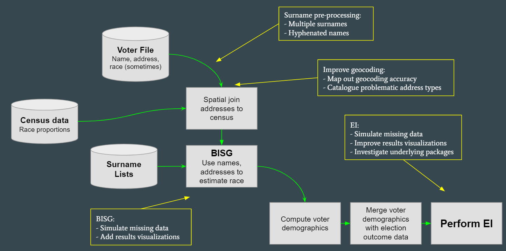
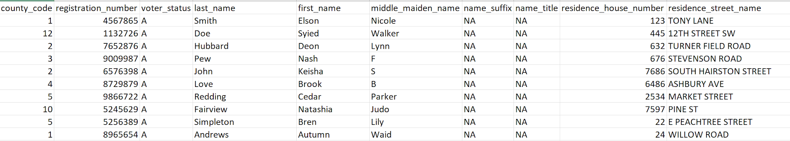
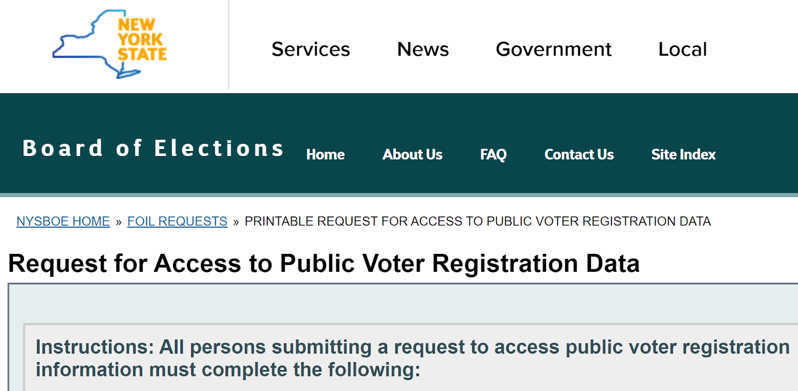

## **Data**

The data needed to carry-out ecological inference for the eiCompare package include a voter file, surname lists, and census data (see figure below). In this section, we discuss what these sources of information are and how they are utilized along the eiCompare pipeline.

**What’s in a voter file?**
The voter file is one of the main sources of information needed to perform ecological inference and detect racially polarized voting. The voter file is used (at the individual level) for predicting the race/ethnicity of each voter and geocoding voter addresses to perform Bayesian Improved Surname Analysis (BISG). 

A voter file typically includes the following information:

  * Voter ID
  * Voter registration status
  * Voter status reason
  * First name
  * Last name
  * Birthdate
  * Address
  * District information related to levels of government

Sometimes the voter file contains racial/ethnic information and other demographic information but this varies greatly by state.

The voter file is public information and attainable via a state designated process that can be either requested by a physical and/or online form (see figure below). The process varies by state, can take up to several weeks to obtain, and may include a fee for processing.

## Census Data
The Census information is used in the eiCompare pipeline to obtain self-reported racial demographic information and linked to a specific location for an individual and household. This information is then used in BISG to help predict racial/ethnicity for voters. The census data files used come from a variety of sources such as shape files according to geographic units (i.e. state, county, block, tract, etc.), and census surname lists according to year. For instance, we are using a surname list from 2010.  Thus, the census data is downloaded as  a shapefile and then combined with voter file information to properly infer whether the voter is living in an area that is predominately of a certain racial group. It is also important to note that the identification of racial categories based on census data is limited to  it representing a portion of the population at a given time period and may not represent the true counts of all racial groups in an area. However, census data gives a close account of the racial demographics of an area by count and proportion depending on the ecological unit (i.e. state, county, block, tract, etc.) you are interested in. 

## Pre-Processing and Cleaning Data

Along the pipeline of obtaining results using eICompare, it is necessary to ensure that the voting file and census data have both been pre-processed and standardized to reduce consequential error in the accuracy of detecting racially polarized voting. In particular, data cleaning involves: properly formatting names and addresses to account for special characters or spacing, the detection of missing information, removing duplicate voter IDs, the simulation of missing information, and visualizations that help detect any discrepancies within the voter file information. We will use the following case of East Ramapo and data from the state of Georgia (which includes race/ethnicity in the voter file) to create R vignettes as a basis for demonstrating how we conduct pre-processing and standardization of the data needed to perform BISG and eICompare. 

**Tools (aka “component specification”)**

What software packages, modules, etc. did you use? 
What are the dependencies between these and how did you render them interoperable?

**Processes**

What does your workflow or pipeline look like? 
What steps did you follow? 

**Analyses**

What approaches did you try that didn’t work?
What analyses did you end up sticking with?

**Limitations**

What are the shortcomings of your approach?
How can your work be improved?
